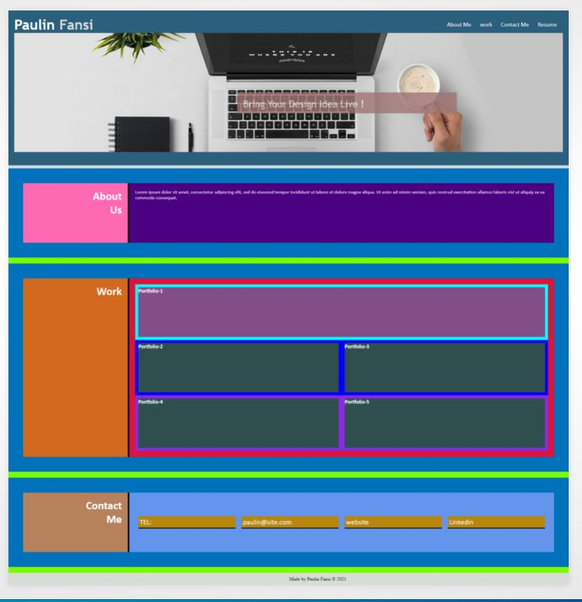
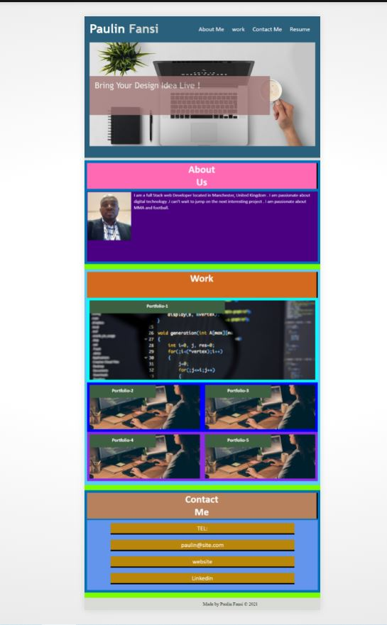
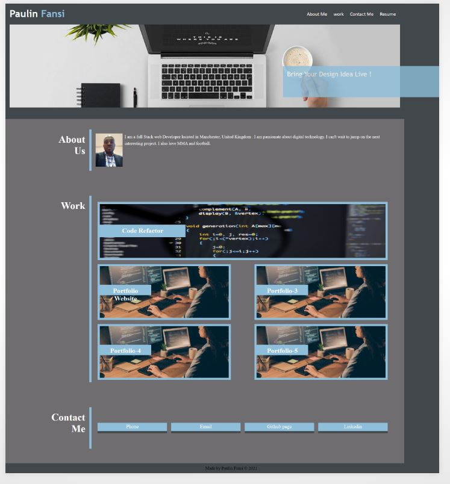

# my-web-apps-portfolio

## Link to the deploy application

https://pfansi.github.io/my-web-apps-portfolio/

## link to the git hub repository

https://github.com/pfansi/my-web-apps-portfolio

## Task Description

I will build a portfolio website that going to talk about me and showcase my numerious web application project .

## Git Repository

I will create a git repository folder that will host the finish website. The Repository will be found [here](https://github.com/pfansi/my-web-apps-portfolio)

## What have you done

- Done a mockup or wireframe of the website on paper to see how all the elements will be grouped together to ease the development stage.

- sectionned the website to contain these sections: a header, a main and a footer.

- The header will contain my name logo and the navigation bar.

- The main content will be divided in rows : About me section , Work section (with link to my multiple portfolio) and the contact me section.

- Downloaded few license free images on pixabay which will be used on the website.

- Coded the entire website using css flex boxes to try and achieve what I drew on the paper (check) link below).

- Structure the website using semantics HTML.

- created a css media query on my style sheet to allow smaller devices such as tablets and smartphones to allow visitors from these devices to have the same user experience as on
  desktop or larger devices.

- Add comments on the index page to describe my design .

- add anchor links for the navigation to link to targeted sections of the website.

- adding the first profile picture link to the main picture has caused issues with my styling layout . It is something I will look into in the future.

- The main picture has been inserted this time as the background picture of the parent div and the a link inserted around that div.

## Screenshots

- using css flex boxes technique , i managed to code and visually achived the look of my finiched website. 

- screenshot on how it looks on smaller devices. 

- few styling issue was encounted when trying to link the pictures to the the external deployed portfolio. 
